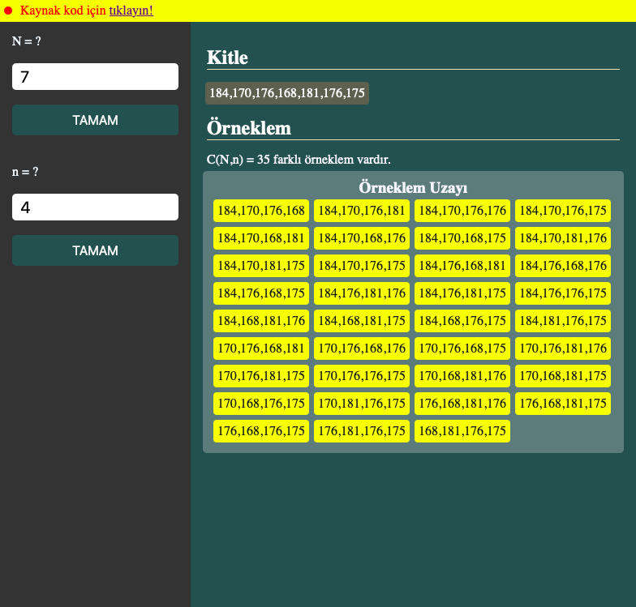

# Sampling Theory

Merhaba, 
Bu **Sampling** projesinde istenilen büyüklükte rastgele kitle oluşturulur. Bu kitle içinden örneklem uzayı elde edilir. Örneklemden yararlanarak kitle hakkında tahminlerde bulunmak amaçlanmıştır.

**HTML, CSS ve JavaScript** kullanılarak oluşturulmuştur. Herhangi bir tarayıcıda çalıştırılabilir.

## Usage
<a href="https://tolgaacgul.github.io/projects/samplingtheory/index.html">Sampling Theory</a> yazısına tıklayarak direk projeye ulaşabilirsiniz. 

## İmages
#### Home

  

